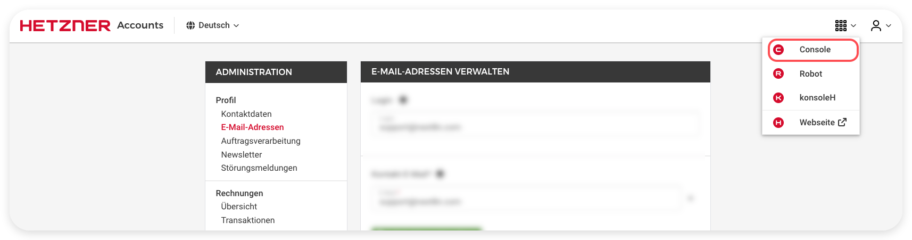
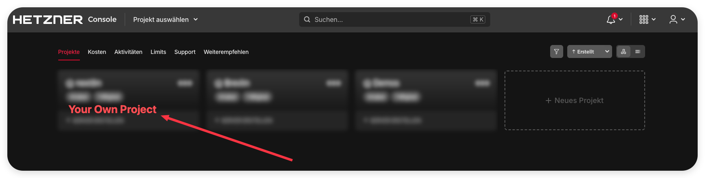
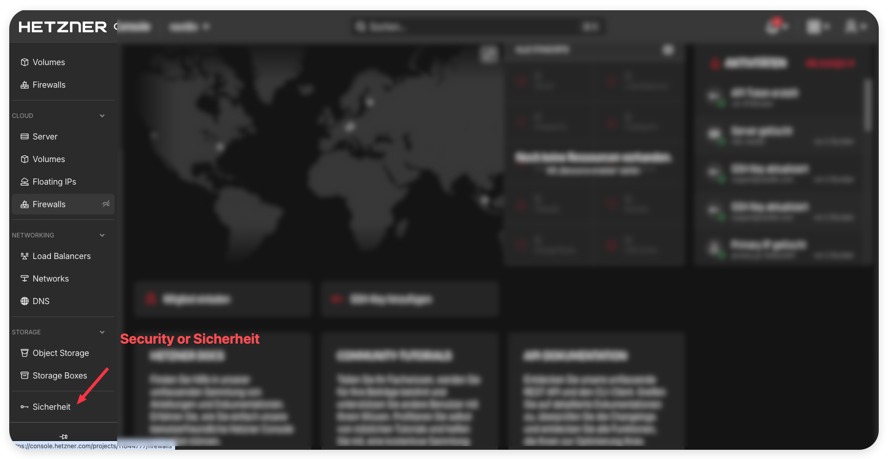
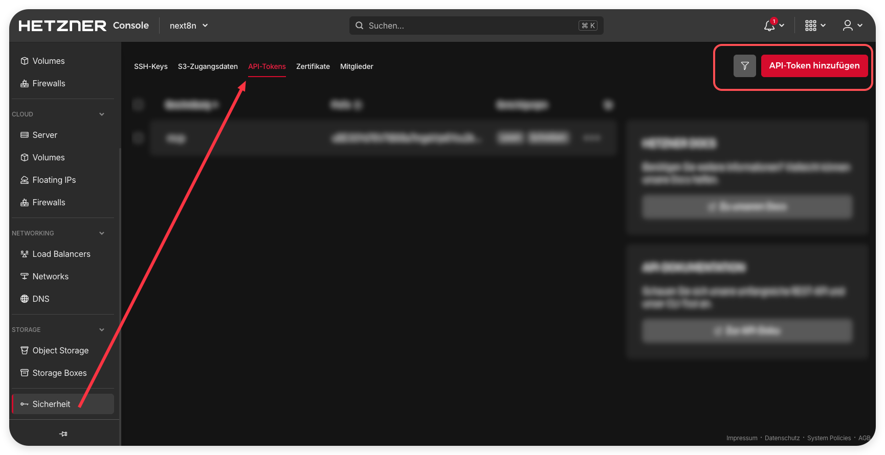
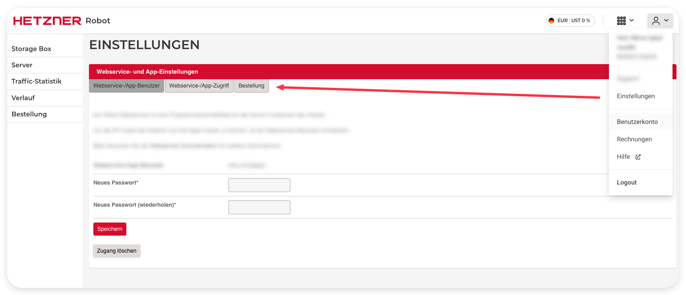

# Setup Guide. Getting Your Hetzner Credentials

This MCP talks to three Hetzner surfaces. You need at most two credentials. This guide is
written so a first-time user can follow it without prior knowledge. Take it slowly, copy
each value into a password manager, and never paste a credential into a public place.

The screenshots below are from a real Hetzner account and show exactly where to click.

## What you need at a glance

| Surface | What it manages | Credential | Required |
|---|---|---|---|
| Cloud | cloud servers, networks, volumes, firewalls, load balancers, IPs, DNS | one Cloud API token | yes, this is the main one |
| Storage Box | backup storage boxes | the SAME Cloud API token | optional, uses the Cloud token |
| Robot | dedicated physical servers, vSwitches | a Robot webservice user and password | only if you use dedicated servers |

If you only use Hetzner Cloud, you need just the Cloud API token. Robot is a separate
product for dedicated servers and most cloud users can skip it.

## 1. Cloud API token (the main credential)

Step 1. Open the Hetzner Cloud Console at https://console.hetzner.com and log in.



Step 2. Choose the project you want to manage, or create one.



Step 3. In the left menu open Security, in German Sicherheit.



Step 4. Open the API Tokens tab, then click Generate API Token, in German
API-Token hinzufuegen. Give it a name like mcp-token, choose Read and Write so you can
create and manage resources, or Read only for a safe look but do not touch token.



Step 5. Click Generate and copy the token immediately. Hetzner shows it once only. Store
it in your password manager. This single token also works for the Storage Box API.

## 2. Robot webservice user (only for dedicated servers)

Robot is a different console from the Cloud Console. Do this only if you have, or plan to
have, physical dedicated servers.

1. Open the Robot console at https://robot.hetzner.com and log in with your Hetzner login.
2. If you see no dedicated servers, you are cloud only. Stop here, you do not need Robot.
3. Open the user menu at the top right, then Settings, in German Einstellungen.
4. Open Web service and app settings, in German Webservice- und App-Einstellungen. The
   first tab is Webservice-/App-Benutzer.
5. Type a strong password into New password and again into Repeat new password, in German
   Neues Passwort and Neues Passwort (wiederholen). Click Create user, in German Benutzer
   anlegen, or Save, in German Speichern.
6. The page then shows your webservice username. It looks like #ws+XXXXXXXX. You only chose
   the password, Hetzner assigns the username.



Note. Managing existing dedicated servers needs nothing more. Only if you later want to
order new dedicated servers through the API do you also enable Ordering, in German
Bestellung, on that same settings page.

## 3. Give the credentials to the MCP

Copy .env.example to .env in the project root and fill it in.

```
HETZNER_CLOUD_TOKEN=your-cloud-api-token
# Robot is optional, only if you use dedicated servers
HETZNER_ROBOT_USER=#ws+XXXXXXXX
HETZNER_ROBOT_PASSWORD=your-robot-password
```

The .env file is git ignored. Never commit it. Never share it. If a token leaks, revoke it
in the console and generate a new one.

## 4. Confirm it works, at zero cost

Every check below is a read, and reads are always free on Hetzner. After you configure the
MCP, ask it to list your servers, list your storage boxes, and, if you set up Robot, list
your dedicated servers. If those return without an authentication error, you are ready.

## Safety and cost

This MCP never creates a resource that costs money without you confirming first, and it
shows you the hourly and monthly price before it does. Listing and reading never cost
anything. See docs/ROADMAP.md for the full cost doctrine.
