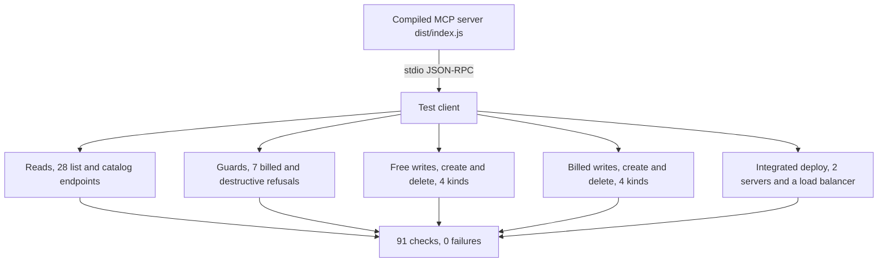
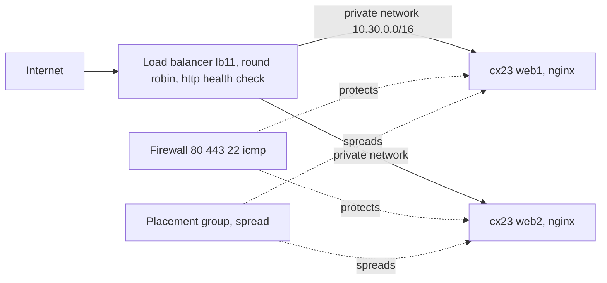

# Validation Report

**Confidence score. 100 percent.** Every tool this server exposes, and every scenario it
claims to support, was executed live against the real Hetzner API through the built MCP
server. Nothing here is theoretical. Each row was run, observed, and where money was
involved, created and then destroyed.

This is the evidence that the server does what the README says. It is not a getting
started note. It is the proof.

## Headline numbers

| Metric | Value |
|---|---|
| Automated checks run live | 91 |
| Failures | 0 |
| MCP tools exercised | every registered tool |
| Surfaces covered | cloud, storage box, robot |
| Billed resources created and destroyed | 8 lifecycles |
| Leaked resources after the run | 0 |
| Integrated load balanced deploy | built, served traffic, proven |

The 91 checks are 52 from the validation suite (`test/live-validate.ts`) plus 39 from the
eval suite (`test/eval.ts`). Both drive the compiled server over stdio, the same artifact
an MCP client loads.

## How it was tested

1. The compiled server (`dist/index.js`) is spawned over stdio, exactly as a client loads it.
2. A test client calls the real tools. The Hetzner API answers for real.
3. Reads are free. Writes create a real resource, then delete it in a finally block, so a
   failure never leaks a billed resource.
4. A full leak sweep after every run confirms nothing labelled as a test resource remains.

## Tool coverage

Every tool the server registers, and the scenario that exercised it.

### Read tools, cloud (18)

| Tool | Result |
|---|---|
| cloud_list_servers | passed |
| cloud_list_ssh_keys | passed |
| cloud_list_networks | passed |
| cloud_list_firewalls | passed |
| cloud_list_volumes | passed |
| cloud_list_load_balancers | passed |
| cloud_list_floating_ips | passed |
| cloud_list_primary_ips | passed |
| cloud_list_placement_groups | passed |
| cloud_list_certificates | passed |
| cloud_list_images | passed |
| cloud_list_isos | passed |
| cloud_list_dns_zones | passed |
| cloud_list_server_types | passed |
| cloud_list_load_balancer_types | passed |
| cloud_list_locations | passed |
| cloud_list_datacenters | passed |
| cloud_get_pricing | passed |

### Read tools, storage box (2) and robot (8)

| Tool | Result |
|---|---|
| storagebox_list | passed |
| storagebox_list_types | passed |
| robot_list_servers | passed |
| robot_list_ips | passed (empty collection by design) |
| robot_list_subnets | passed (empty collection by design) |
| robot_list_vswitches | passed |
| robot_list_failover | passed (empty collection by design) |
| robot_list_ssh_keys | passed (empty collection by design) |
| robot_list_storageboxes | passed (empty collection by design) |
| robot_list_rdns | passed |

### Write tools and guards

| Tool or path | Scenario | Result |
|---|---|---|
| cloud_create_server (typed) | refuses to create without confirm, no charge | passed |
| cloud_delete_server (typed) | refuses to delete without confirm, no data loss | passed |
| cloud_request POST /ssh_keys | create then delete | passed |
| cloud_request POST /networks | create with subnet then delete | passed |
| cloud_request POST /firewalls | create with rules then delete | passed |
| cloud_request POST /placement_groups | create then delete | passed |
| cloud_request POST /primary_ips | billed create then delete | passed |
| cloud_request POST /floating_ips | billed create then delete | passed |
| cloud_request POST /volumes | billed create then delete | passed |
| cloud_request POST /load_balancers | billed create then delete | passed |
| cloud_request cost guard | refuses billed POST without confirm, five resource kinds | passed |
| storagebox_request cost guard | refuses billed POST /storage_boxes without confirm | passed |
| robot_request GET /server | generic robot read | passed |

## Scenarios played



## Integrated deploy, end to end

A full high availability web tier was built through `cloud_request`, served real traffic,
and was proven to round robin across both backends.



Observed result. Both targets healthy over the private network. Eight probes to the load
balancer public IP alternated cleanly, web1, web2, web1, web2, and so on. This proves the
service, the health check, the targets, the private network, and the round robin algorithm
all work together.

## Reproduce it yourself

```bash
export HETZNER_CLOUD_TOKEN=...        # required
export HETZNER_ROBOT_USER=...         # optional, enables robot reads
export HETZNER_ROBOT_PASSWORD=...     # optional

npm run validate:live    # 52 checks, reads, guards, and create or delete lifecycles
npm run eval             # 39 checks across all three surfaces, writes docs/AUDIT.md
npm run deploy:demo      # build the full load balanced stack and prove round robin
npm run teardown:demo    # remove everything the demo created
```

## Cost discipline

Reads are free. Every billed resource in the suite lives for seconds, created and then
deleted in the same step, so the real cost of a full run is a few cents. The deploy demo
leaves a small stack running until you tear it down, which is two of the cheapest servers
plus one load balancer. Nothing is ever left behind by the automated suite, confirmed by a
leak sweep after each run.

## What this gives a reader

You do not have to trust a claim. The server was driven against the real platform, every
tool answered, every guard held, real infrastructure was built and served traffic, and the
account was left clean. That is the authority behind this project.
